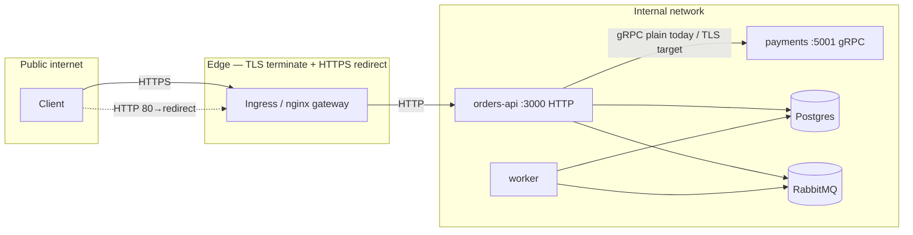

# TLS і «хто з ким говорить»

## Де закінчується TLS

Коротко: **TLS на edge**, не всередині Nest-контейнера.

| Звідки куди                                          | TLS?                                                                                                                                                           |
| ---------------------------------------------------- | -------------------------------------------------------------------------------------------------------------------------------------------------------------- |
| Інтернет → Ingress (k8s) або локальний nginx-gateway | Так, тут і має бути                                                                                                                                            |
| Ingress/nginx → `orders-api` (порт типу 3000)        | Зазвичай **HTTP** по внутрішній мережі — нормальний патерн                                                                                                     |
| Nest у контейнері                                    | Слухає HTTP; TLS на додатку не піднімали навмисно                                                                                                              |
| orders-api → payments по gRPC                        | Зараз **plain gRPC** у docker/k8s (внутрішній L4). Для справжнього prod хочеться хоча б TLS, краще mTLS — через mesh, sidecar або `grpc.credentials.createSsl` |
| Postgres, RabbitMQ                                   | У навчальному compose/k8s — без TLS до БД/черги; у «живому» prod часто або TLS з клієнта, або приватна підмережа + політики                                    |

## Редирект HTTP → HTTPS

У k8s: в `k8s/ingress.yaml` є `nginx.ingress.kubernetes.io/ssl-redirect: "true"` і блок `tls` з `secretName`. Сертифікати в репо не кладемо — їх робить cert-manager / ops.

Локально: базовий `docker/nginx/local-gateway.conf` — це HTTP на хості (у нас порт **9080**). Якщо хочемо побавитись з HTTPS локально — є `docker/nginx/local-gateway.tls.example.conf`: скопіювати як `default.conf`, додати серти, зручно через [mkcert](https://github.com/FiloSottile/mkcert).

## Типи трафіку

**Public** — те, що з інтернету приходить на edge по HTTPS (потім уже HTTP до API): REST, `/graphql`, в non-prod ще `/api-docs`, `/health`.

**Internal** — HTTP від ingress до API, gRPC до payments, TCP до Postgres, AMQP до RabbitMQ. У типовому профілі це не світиться наружу.

**Тільки placement** — worker (consumer), gRPC payments без publish на хост у `docker-compose.local.yml` (там `expose`). Доступ по суті лише з тієї ж docker network / pod network; в prod сюди ще додають NetworkPolicy / firewall, якщо дійшли рук.

## Схема

## Де шукати в репо

- `k8s/ingress.yaml` — host, tls, ssl-redirect, бекенд на orders-api
- `docker/nginx/local-gateway.conf` — локальний HTTP reverse-proxy
- `docker/nginx/local-gateway.tls.example.conf` — приклад 443 + редирект з 80
- `k8s/deployments.yaml` — порти без TLS у контейнерах (очікується TLS на edge)

Шифруємо на вході (Ingress / локальний nginx з TLS), всередині кластеру/compose — HTTP до API і plain gRPC між сервісами **поки що**. Далі логічний крок для prod — TLS/mTLS на gRPC і за потреби TLS до БД. Throttling по реальному клієнту — через `X-Forwarded-For`, див. `RATE-LIMIT-AND-HEADERS.md`.