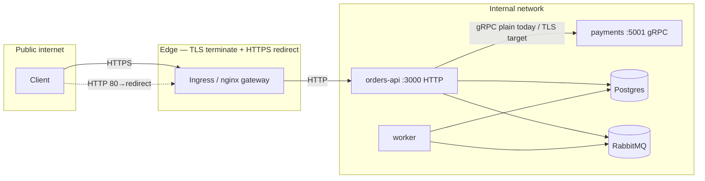

# TLS і «хто з ким говорить»

Як я це собі малюю: **TLS закінчується на edge**, а не всередині Nest-контейнера. Далі — довірена внутрішня мережа (в ідеалі), і вже там HTTP/plain gRPC.

| Звідки куди | TLS? |
| ----------- | ---- |
| Інтернет → Ingress (k8s) або локальний nginx-gateway | Так, тут і має бути |
| Ingress/nginx → `orders-api` (порт типу 3000) | Зазвичай **HTTP** по внутрішній мережі — нормальний патерн |
| Nest у контейнері | Слухає HTTP; TLS на додатку ми навмисно не піднімали |
| orders-api → payments (gRPC) | Зараз **plain gRPC** у docker/k8s. У «живому» проді я б хотіла хоча б TLS, краще mTLS — mesh, sidecar або `grpc.credentials.createSsl` |
| Postgres, RabbitMQ | У навчальному compose/k8s без TLS до БД/черги; у проді часто TLS з клієнта або приватна підмережа + політики |

## Редирект HTTP → HTTPS

У k8s: у `k8s/ingress.yaml` є `nginx.ingress.kubernetes.io/ssl-redirect: "true"` і блок `tls` з `secretName`. Серти в репо не кладемо — їх робить cert-manager або ops.

Локально: `docker/nginx/local-gateway.conf` — HTTP на хості (у нас **9080**). Якщо хочеться погратись з HTTPS локально — є `docker/nginx/local-gateway.tls.example.conf`: скопіювати як `default.conf`, додати серти, зручно через [mkcert](https://github.com/FiloSottile/mkcert).

## Типи трафіку (як я їх називаю)

**Public** — з інтернету на edge по HTTPS, далі вже HTTP до API: REST, `/graphql`, у non-prod ще `/api-docs`, `/health`.

**Internal** — HTTP від ingress до API, gRPC до payments, TCP до Postgres, AMQP до RabbitMQ. У нормальному профілі це не світиться наружу.

**Placement** — worker (consumer), gRPC payments без publish на хост у `docker-compose.local.yml` (там `expose`). Доступ по суті з тієї ж docker network / pod network; у проді сюди ще NetworkPolicy / firewall, коли дійдуть руки.

## Схема

## Де шукати в репо

- `k8s/ingress.yaml` — host, tls, ssl-redirect, бекенд на orders-api
- `docker/nginx/local-gateway.conf` — локальний HTTP reverse-proxy
- `docker/nginx/local-gateway.tls.example.conf` — приклад 443 + редирект з 80
- `k8s/deployments.yaml` — порти без TLS у контейнерах (TLS очікується на edge)

Підсумок для себе: шифруємо на вході (Ingress / nginx з TLS), всередині кластеру поки HTTP до API і plain gRPC між сервісами — **наступний крок** для продакшену я б бачила в TLS/mTLS на gRPC і за потреби TLS до БД. Throttling по реальному клієнту — через `X-Forwarded-For`, детальніше в `RATE-LIMIT-AND-HEADERS.md`.
