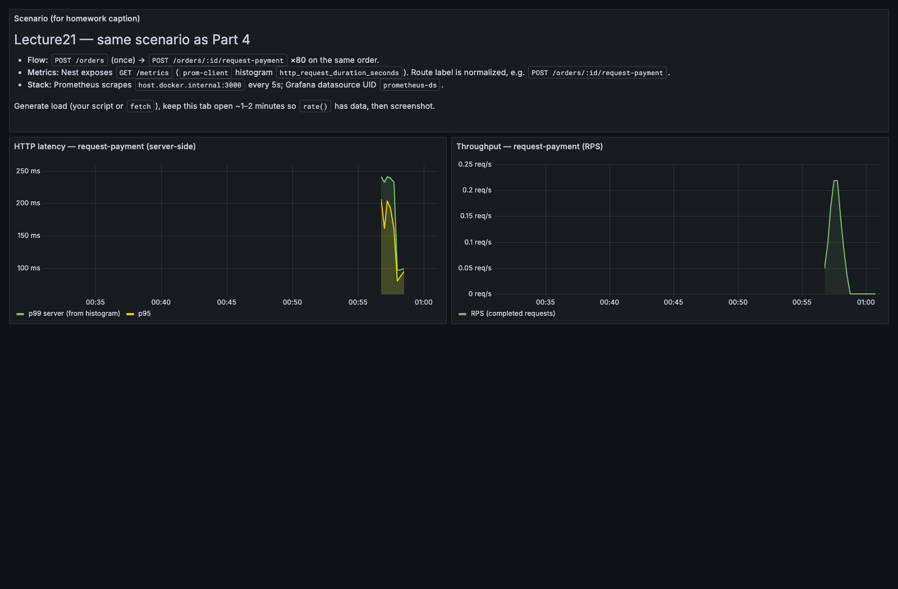
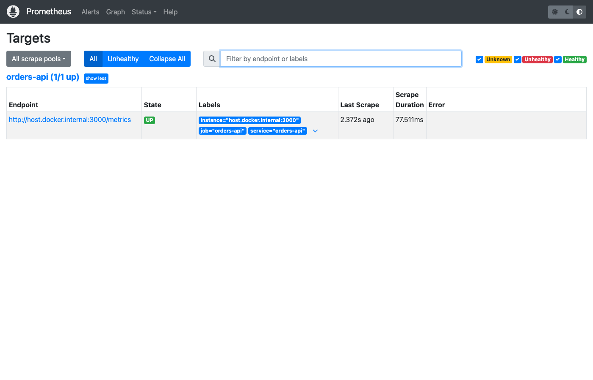

# Homework report — продуктивність (Lecture21)

Тут зібране головне, а цифри й деталі я винесла в окремі файли — нижче є посилання, щоб не гортати простиню в одному місці.

---

## Візуалізації (для скріншотів)
Реальні знімки з **Grafana** і **Prometheus** (локальний `docker-compose.observability.yml`, навантаження `scripts/perf-smoke-for-grafana.mjs`):

---

## Який сценарій я обрала

Я взяла **міні-checkout**: `POST /orders`, потім `POST /orders/:id/request-payment`, очікую `AUTHORIZED`. Щоб чесно порівняти **Before / After**, я прогнала **80 разів підряд лише `request-payment`** на одне й те саме замовлення після одного `create` — так менше шуму від створення ордера.

---

## Як знімала baseline

- Логінилась **один раз** на початку — інакше вперлась би в throttle на `/auth/login` (там жорстко).
- Далі або серійні прогони, або мікро-бенч через **Node `fetch`**: спочатку через gateway **9080**, — напряму **localhost:3000**.
- Паралельно оглядала `docker stats` і RabbitMQ Management по черзі `orders.process` — розписала в [PERFORMANCE-OBSERVATIONS.md](PERFORMANCE-OBSERVATIONS.md).

---

## Який bottleneck знайшла

1. **Overfetch:** на `request-payment` раніше викликався `findOne` з усіма relations (`items`, `items.product`, `user`), а для Authorize з gRPC реально потрібні лише кілька полів з самої таблиці замовлення.
2. **Конкуренція за `Product`:** у `create()` — `pessimistic_write`; паралельні ордери на **один SKU** дають вищу стіну часу й перцентилі, ніж рознесення по кількох товарах — **виміряно** в [PERFORMANCE-CREATE-LOCK-BENCHMARK.md](PERFORMANCE-CREATE-LOCK-BENCHMARK.md).

---

## Які дві зміни внесла

1. **Performance:** додала **`findOrderForPaymentAuthorize`** — вузький `select` без JOIN-ів і підключила його з `requestPaymentForOrder` у `src/orders/orders.service.ts`.
2. **Cost / runtime:** прописала **`resources.requests` / `resources.limits`** для `orders-api`, `payments`, `worker` у `k8s/deployments.yaml`, бо без цього поди в кластері «плавають» по ресурсу.

---

## Як змінилися метрики (Before / After)

Повний контекст прогону — у [PERFORMANCE-BEFORE-AFTER.md](PERFORMANCE-BEFORE-AFTER.md). Коротко таблицею:

| Метрика | До | Після | Коментар |
|--------|-----|--------|------------|
| p95 (`request-payment`, ms) | 9.60 | 10.26 | Скоріше джиттер одного ноута, не сигнал регресії |
| p99 (ms) | 52.99 | 14.25 | Хвіст скоротився приблизно в 3.7 рази — це вже приємно |
| Throughput (req/s, 80×) | 145.65 | 166.95 | Порядку +14.6% |
| Error rate | 0/80 | 0/80 | Нічого не відвалилось |
| K8s resources | не задані | requests + limits | На локальному RPS це не видно; ефект саме в кластері |

---

## Trade-offs (чесно)

Розписала в [PERFORMANCE-TRADEOFFS.md](PERFORMANCE-TRADEOFFS.md): окремий шлях читання поруч з `findOne` — треба не забути оновлювати, якщо зміняться правила оплати; по K8s — якщо занизити limits, буде throttle або OOM. Там же я додала короткий **FinOps**-абзац: як `requests`/`limits` пов’язані з тим, скільки подів реально сяде на вузол і чому це близько до «грошей», навіть без конкретної фактури.

---

## Доказ bottleneck через SQL

Я порівняла **Narrow vs Wide** плани в Postgres — інструкція в [PERFORMANCE-SQL-AND-TRACE.md](PERFORMANCE-SQL-AND-TRACE.md), готовий скрипт: [scripts/perf-explain-order-queries.sql](../scripts/perf-explain-order-queries.sql). У dev ще можна подивитись SQL у консолі Nest при `NODE_ENV=development`.

---

## Список змін (що / чому / ефект)

| Що змінила | Навіщо | Що вийшло |
|------------|--------|-----------|
| **`findOrderForPaymentAuthorize` + виклик з `requestPaymentForOrder`** | Прибрати зайві JOIN-и на гарячому шляху оплати | Нижчий **p99**, вищий **throughput** на ізольованому `request-payment` |
| **`resources` у `k8s/deployments.yaml`** | Щоб планувальник кластера бачив запити й мав стелю по пам’яті/CPU | Передбачуваніший capacity, менший ризик «безлімітного» пода; далі див. throttle/restarts |

---

## Де копати глибше

- [PERFORMANCE-OBSERVATIONS.md](PERFORMANCE-OBSERVATIONS.md) — baseline, що дивилась, висновки
- [PERFORMANCE-BEFORE-AFTER.md](PERFORMANCE-BEFORE-AFTER.md) — таблиця й умови виміру
- [PERFORMANCE-TRADEOFFS.md](PERFORMANCE-TRADEOFFS.md) — trade-offs, FinOps, що б я моніторила в проді
- [PERFORMANCE-SQL-AND-TRACE.md](PERFORMANCE-SQL-AND-TRACE.md) — `EXPLAIN` + лог SQL
- [PERFORMANCE-CREATE-LOCK-BENCHMARK.md](PERFORMANCE-CREATE-LOCK-BENCHMARK.md) — другий bottleneck: hot SKU vs spread, скрипт `perf-create-lock-contention.mjs`
